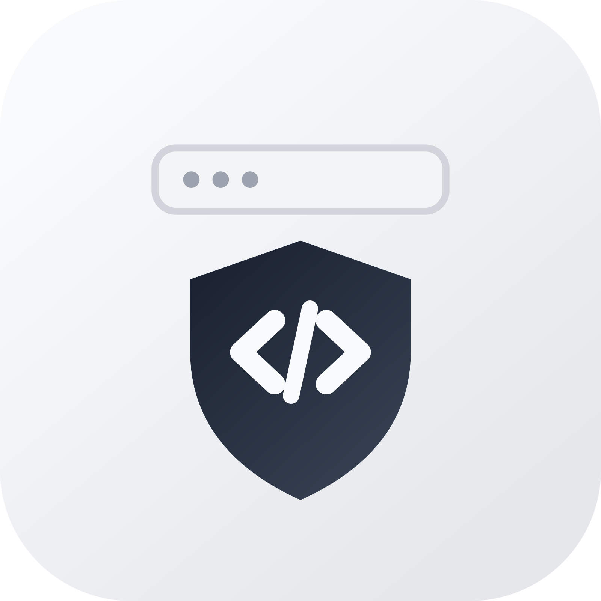

# Native Obfuscator GUI

<p align="center">
  
</p>

## Project Overview

Native Obfuscator GUI is a JavaFX desktop application for Java application protection workflows. It builds on the Native Obfuscator conversion engine to transform selected Java bytecode into generated C++ native code, then produces an output JAR that can be packaged and executed with native components.

The project keeps the original command-line interface while adding a graphical workflow for day-to-day use. Users can select or drag input files, configure processing scope, choose a target platform, monitor real-time console output, and receive clear conversion status feedback. The UI uses a clean white and gray visual style and defaults to English.

In addition to basic conversion, the GUI includes a native build pipeline. After generating C++ sources, it can invoke CMake and Ninja to compile a native dynamic library and optionally embed that library into the output JAR. On Windows x64, missing CMake, Ninja, or C++ toolchain components can be downloaded automatically into a local tools directory.

This project is suitable for Java desktop applications, server-side components, and other Java projects that need stronger resistance against static inspection and reverse engineering. It supports both interactive GUI usage and scriptable CLI usage.

## Features

- JavaFX GUI with a white and gray visual style.
- Input JAR selection through file picker or drag and drop.
- Optional libraries directory, blacklist file, and whitelist file configuration.
- Target platform selection: `HotSpot`, `Standard`, and `Android`.
- Optional `@Native` / `@NotNative` annotation handling.
- Automatic C++ compilation through CMake and Ninja after conversion.
- Optional local download of missing build tools.
- Optional embedding of the compiled native dynamic library into the output JAR.


## Tech Stack

- Java 8 source/target compatibility
- JavaFX 17
- Gradle Wrapper
- Shadow Jar
- ASM 9.8
- Picocli
- SLF4J + Log4j2
- CMake + Ninja
- w64devkit as the default auto-downloaded C++ toolchain on Windows x64

## Requirements

- JDK 17 or newer is recommended for building and running the project.
- The Java part can be built on Windows, macOS, and Linux.
- Automatic download of CMake, Ninja, and w64devkit currently supports Windows x64 only.
- For native auto-compilation on non-Windows x64 environments, install these tools manually:
  - CMake
  - Ninja
  - A C++ compiler such as `g++`, `clang++`, or MSVC `cl`

## Quick Start


```powershell
.\gradlew.bat :obfuscator:assemble -PjavafxPlatform=win
```

Supported platform classifier examples:


## GUI Usage

1. Choose or drag the input JAR.
2. Choose an output directory. It should not be the same directory as the input JAR.
3. Optionally choose a libraries directory, blacklist file, and whitelist file.
4. Select the target platform in `Platform`.
5. Enable annotation processing or debug JAR output if needed.
6. Configure native build options in the `Native` tab.
7. Click `Run` to start conversion. The UI automatically switches to the Console tab.

### Native Build Options

- `Plain Lib`: sets the raw library name used by LoaderPlain.
- `Native Dir`: sets the native directory used by LoaderUnpack.
- `Tools Dir`: local tools directory. The default is `.native-obfuscator/tools` under the user home directory.
- `Auto compile`: compiles the generated C++ sources after conversion.
- `Embed in JAR`: inserts the compiled dynamic library into the output JAR.
- `Auto download tools`: downloads missing CMake, Ninja, or Windows C++ toolchain components.
- `Build Type`: chooses `Release` or `Debug`.

Do not set `Plain Lib` when `Embed in JAR` is enabled. Embedding requires LoaderUnpack.

## Command-Line Usage

The GUI is the default entry point. To use the original CLI, specify the CLI main class explicitly:

```powershell
java -cp obfuscator/build/libs/obfuscator.jar by.radioegor146.Main <input.jar> <output-dir> [options]
```

Common options:

```text
-l, --libraries <dir>       Directory containing dependency libraries
-b, --black-list <file>     File containing blacklist rules
-w, --white-list <file>     File containing whitelist rules
--plain-lib-name <name>     Library name used by LoaderPlain
--custom-lib-dir <dir>      Native directory used by LoaderUnpack
-p, --platform <platform>   hotspot, std_java, or android
-a, --annotations           Enable annotation rules
--debug                     Generate debug.jar
```

Example:

```powershell
java -cp obfuscator/build/libs/obfuscator.jar by.radioegor146.Main app.jar out -l libs -p hotspot -a
```

## Project Structure

```text
.
|-- annotations/     Native Obfuscator annotation module
|-- obfuscator/      Core converter, CLI, JavaFX GUI, and native build pipeline
|-- gradle/          Gradle Wrapper files
|-- build.gradle     Root Gradle configuration
`-- settings.gradle  Gradle subproject declaration
```

Key packages:

```text
by.radioegor146                 Core converter and CLI
by.radioegor146.gui             JavaFX GUI
by.radioegor146.gui.build       Native auto-compilation, toolchain resolution, and JAR embedding
```

## Tests

Run the obfuscator module tests:

```powershell
.\gradlew.bat :obfuscator:test
```

Some integration tests depend on external CMake/toolchain availability. Those tests are skipped when the required environment is missing, and the basic unit tests can still pass.

## License

This project is licensed under GPL-3.0. See `LICENSE` for details.
